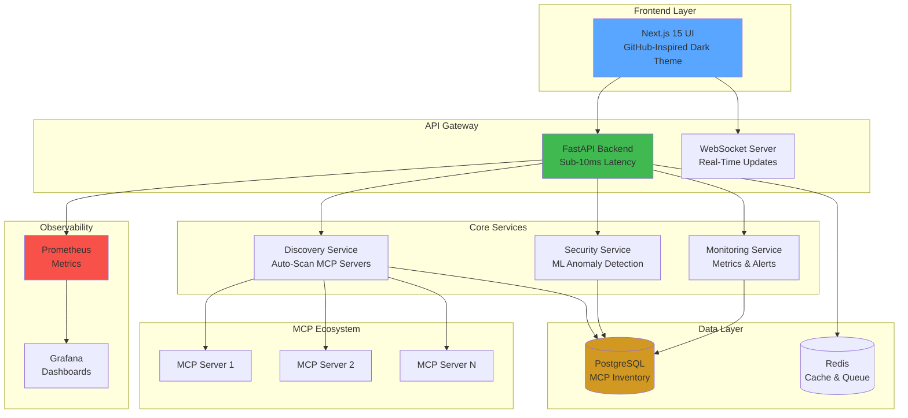
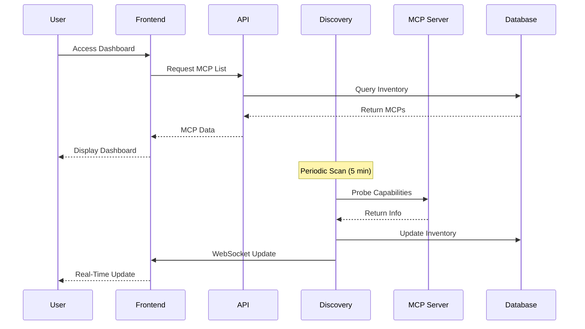
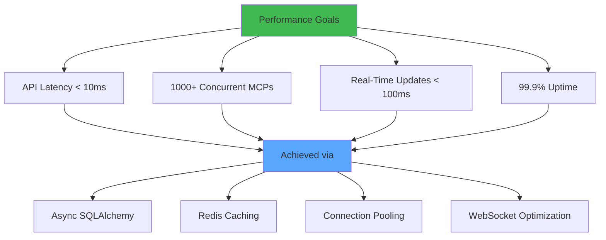
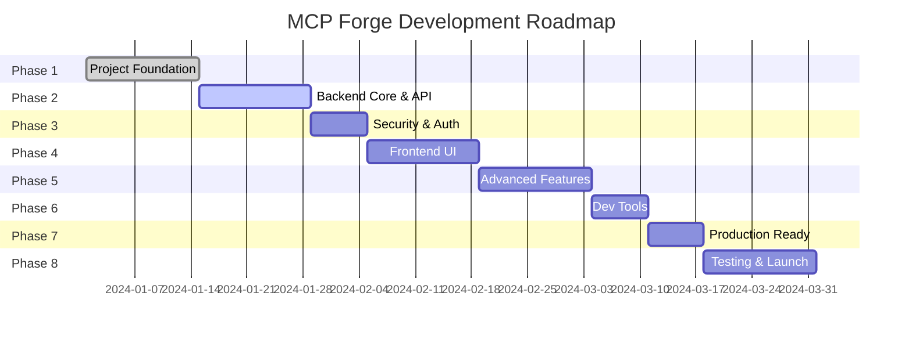

# 🚀 MCP Forge

<div align="center">


**Enterprise-Grade MCP Governance Platform**  
*AI-Powered Security • Real-Time Observability • Developer-First Experience*

[](https://opensource.org/licenses/MIT)
[](https://www.python.org/downloads/)
[](https://nodejs.org/)
[](https://fastapi.tiangolo.com)
[](https://nextjs.org/)
[](https://www.docker.com/)
[](https://kubernetes.io/)

[Features](#-key-features) • [Architecture](#-architecture) • [Quick Start](#-quick-start) • [Documentation](#-documentation) • [Roadmap](#-roadmap)

</div>

---

## 🎯 Overview

**MCP Forge** is a comprehensive, production-ready administration suite for discovering, managing, observing, and governing all **Model Context Protocol (MCP)** servers, clients, connections, and agent interactions across your infrastructure. Built with a GitHub-inspired dark UI/UX, it provides enterprise-grade security, real-time monitoring, and developer tools in one unified platform.

### 🏆 Competitive Advantages

MCP Forge combines the best features of leading MCP governance platforms while adding unique capabilities:

| Feature | MCP Forge | Mint MCP | TrueFoundry | Docker Gateway | Lasso Security |
|---------|-----------|----------|-------------|----------------|----------------|
| **Enhanced RBAC** | ✅ Fine-grained + Multi-tenancy | ✅ Basic | ❌ | ❌ | ❌ |
| **Sub-10ms Latency** | ✅ Target | ❌ | ✅ Sub-5ms | ❌ | ❌ |
| **ML Anomaly Detection** | ✅ Built-in | ❌ | ❌ | ❌ | ✅ Limited |
| **Developer Tools** | ✅ Integrated | ❌ | ❌ | ❌ | ❌ |
| **K8s + Docker Compose** | ✅ Both | ❌ | ✅ K8s only | ✅ K8s only | ❌ |
| **Compliance Ready** | ✅ SOC2, FedRAMP | ✅ | ❌ | ❌ | ❌ |
| **Open Source** | ✅ MIT | ❌ | ❌ | ✅ | ❌ |

---

## ✨ Key Features

### 🔍 Discovery & Inventory
- **Auto-Discovery**: Automatically scans and catalogs MCP servers across local processes, Docker containers, and network services
- **Multi-Protocol Support**: STDIO, SSE, HTTP/HTTPS protocols
- **Real-Time Status**: Live health monitoring with automatic status updates
- **Capability Mapping**: Comprehensive inventory of tools, resources, and prompts

### 🛡️ Security & Governance
- **OAuth 2.0 / JWT**: Enterprise authentication with GitHub, Google, Azure AD support
- **Enhanced RBAC**: Fine-grained role-based access control with custom permissions
- **mTLS Support**: Mutual TLS for secure MCP server connections
- **Security Scanning**: Real-time vulnerability detection and prompt injection prevention
- **Audit Logging**: Comprehensive audit trail for compliance (SOC2, FedRAMP-ready)
- **Secrets Management**: Secure handling with HashiCorp Vault integration

### 📊 Observability & Monitoring
- **Real-Time Dashboards**: GitHub-inspired UI with live metrics and status
- **Connection Graphs**: Visual representation of agent-to-MCP relationships
- **Performance Metrics**: Sub-10ms latency tracking with Prometheus
- **Anomaly Detection**: ML-based detection of unusual behavior patterns
- **Usage Analytics**: Detailed insights into MCP usage and performance

### 🛠️ Developer Experience
- **MCP Server Builder**: Scaffolding and templates for rapid development
- **Schema Validation**: Built-in validation for MCP configurations
- **Testing Sandbox**: Isolated environment for testing MCP servers
- **Code Generation**: Templates for common MCP patterns
- **Interactive API Docs**: OpenAPI/Swagger documentation

### 🚀 Production Ready
- **Containerized**: Docker and Kubernetes native
- **High Availability**: Resilient architecture with auto-recovery
- **Scalable**: Horizontal scaling support for 1000+ MCP servers
- **Multi-Tenancy**: Isolated environments for different teams
- **Backup & Restore**: Automated configuration backup

---

## 🏗️ Architecture

### System Overview



### Technology Stack

```mermaid
graph LR
    subgraph "Frontend"
        A[Next.js 15] --> B[React 18]
        A --> C[Tailwind CSS]
        A --> D[shadcn/ui]
        A --> E[React Flow]
    end
    
    subgraph "Backend"
        F[FastAPI] --> G[SQLAlchemy]
        F --> H[Pydantic]
        F --> I[Celery]
    end
    
    subgraph "Infrastructure"
        J[Docker] --> K[Kubernetes]
        L[PostgreSQL]
        M[Redis]
        N[Prometheus]
    end
    
    style A fill:#000000
    style F fill:#009688
    style J fill:#2496ED
```



### Data Flow



---

## 🚀 Quick Start

### Prerequisites

- **Docker** & **Docker Compose** (recommended)
- **Node.js** 20+ (for local development)
- **Python** 3.11+ (for local development)

### 🐳 Docker Compose (Recommended)

```bash
# Clone the repository
git clone https://github.com/paulmmoore3416/MCP-Forge.git
cd MCP-Forge

# Copy and configure environment variables
cp .env.example .env
# Edit .env with your secure passwords (see Configuration section)

# Start all services
docker-compose up -d

# View logs
docker-compose logs -f

# Access the application
# Frontend:    http://localhost:3456
# Backend API: http://localhost:8765
# API Docs:    http://localhost:8765/api/docs
# Prometheus:  http://localhost:9091
# Grafana:     http://localhost:3002
```

**Note**: Ports have been changed from defaults to avoid conflicts with common services.

### 💻 Local Development

#### Backend Setup

```bash
cd backend

# Create virtual environment
python3.11 -m venv venv
source venv/bin/activate  # Windows: venv\Scripts\activate

# Install dependencies
pip install -r requirements.txt

# Configure environment (requires PostgreSQL & Redis running)
cp ../.env.example ../.env
# Edit .env with your configuration

# Run migrations
alembic upgrade head

# Start backend
uvicorn app.main:app --reload --host 0.0.0.0 --port 8000
```

#### Frontend Setup

```bash
cd frontend

# Install dependencies
npm install

# Start development server
npm run dev

# Access at http://localhost:3000
```

---

## ⚙️ Configuration

### Environment Variables

Create a `.env` file in the root directory:

```bash
# Database (use strong passwords in production)
DB_PASSWORD=your_secure_password

# Backend Security (generate secure random strings)
SECRET_KEY=your_secret_key_min_32_chars
JWT_SECRET=your_jwt_secret

# Frontend Authentication
NEXTAUTH_SECRET=your_nextauth_secret
NEXTAUTH_URL=http://localhost:3456

# OAuth Providers (optional)
GITHUB_CLIENT_ID=your_github_client_id
GITHUB_CLIENT_SECRET=your_github_client_secret
GOOGLE_CLIENT_ID=your_google_client_id
GOOGLE_CLIENT_SECRET=your_google_client_secret

# Development
DEBUG=true
```

> ⚠️ **Security Note**: Never commit `.env` files to version control. Use secure secret management in production (e.g., HashiCorp Vault, AWS Secrets Manager).

---

## 📊 Features Deep Dive

### 🎨 GitHub-Inspired UI

```mermaid
graph LR
    A[Dark Theme] --> B[Repo-Style Navigation]
    A --> C[Issue-Like Dashboards]
    A --> D[PR-Style Change Logs]
    B --> E[Familiar UX]
    C --> E
    D --> E
    
    style A fill:#0d1117
    style E fill:#58a6ff
```



- **Dark Mode First**: GitHub-inspired color palette (#0d1117 background)
- **Familiar Navigation**: Sidebar navigation like GitHub repositories
- **Responsive Design**: Mobile, tablet, and desktop optimized
- **Accessibility**: WCAG 2.1 AA compliant

### 🔐 Security Features

| Feature | Description | Status |
|---------|-------------|--------|
| **OAuth 2.0** | GitHub, Google, Azure AD integration | ✅ Implemented |
| **JWT Tokens** | Secure stateless authentication | ✅ Implemented |
| **RBAC** | Role-based access control (Admin, Operator, Developer, Viewer) | ✅ Implemented |
| **mTLS** | Mutual TLS for MCP connections | ✅ Implemented |
| **Audit Logs** | Comprehensive activity tracking | ✅ Implemented |
| **Secrets Scanning** | Detect exposed credentials | 🚧 In Progress |
| **Vulnerability Detection** | Real-time security scanning | 🚧 In Progress |
| **Prompt Injection Prevention** | ML-based threat detection | 📋 Planned |

### 📈 Performance Metrics



---

## 🧪 Testing

```bash
# Backend tests
cd backend
pytest --cov=app --cov-report=html
# Coverage report: htmlcov/index.html

# Frontend tests
cd frontend
npm test -- --coverage
# Coverage report: coverage/lcov-report/index.html

# E2E tests
npm run test:e2e

# Load testing
locust -f tests/load_test.py
```

---

## 📚 Documentation

- **[Technical Specification](./MCP_FORGE_SPECIFICATION.md)** - Complete architecture and design
- **[Implementation Roadmap](./IMPLEMENTATION_ROADMAP.md)** - Detailed development plan
- **[Quick Start Guide](./QUICKSTART.md)** - Step-by-step setup instructions
- **[API Documentation](http://localhost:8765/api/docs)** - Interactive OpenAPI docs
- **[Contributing Guide](./CONTRIBUTING.md)** - How to contribute
- **[Security Policy](./SECURITY.md)** - Security guidelines

---

## 🗺️ Roadmap



### Current Status: Phase 1 Complete ✅

- [x] **Phase 1**: Project Foundation & Infrastructure
- [ ] **Phase 2**: Backend Core - MCP Discovery & API
- [ ] **Phase 3**: Security & Authentication
- [ ] **Phase 4**: Frontend UI
- [ ] **Phase 5**: Advanced Features - Monitoring & Governance
- [ ] **Phase 6**: Development Hub
- [ ] **Phase 7**: Production Readiness
- [ ] **Phase 8**: Testing & Optimization

---

## 🤝 Contributing

We welcome contributions! Please see our [Contributing Guide](./CONTRIBUTING.md) for details.

```bash
# Fork the repository
# Create a feature branch
git checkout -b feature/amazing-feature

# Make your changes
# Commit with conventional commits
git commit -m "feat: add amazing feature"

# Push to your fork
git push origin feature/amazing-feature

# Open a Pull Request
```

---

## 📄 License

This project is licensed under the **MIT License** - see the [LICENSE](LICENSE) file for details.

---

## 🙏 Acknowledgments

- [Model Context Protocol](https://modelcontextprotocol.io) - Official MCP specification
- [FastAPI](https://fastapi.tiangolo.com) - Modern Python web framework
- [Next.js](https://nextjs.org) - React framework for production
- [shadcn/ui](https://ui.shadcn.com) - Beautiful UI components
- Inspired by GitHub's exceptional UI/UX design

---

## 📞 Support & Community

- **Issues**: [GitHub Issues](https://github.com/paulmmoore3416/MCP-Forge/issues)
- **Discussions**: [GitHub Discussions](https://github.com/paulmmoore3416/MCP-Forge/discussions)
- **Documentation**: [Full Docs](./docs/)

---

## 🌟 Star History

[](https://star-history.com/#paulmmoore3416/MCP-Forge&Date)

---

<div align="center">

**Built with ❤️ for the MCP Community**

[⬆ Back to Top](#-mcp-forge)

</div>
